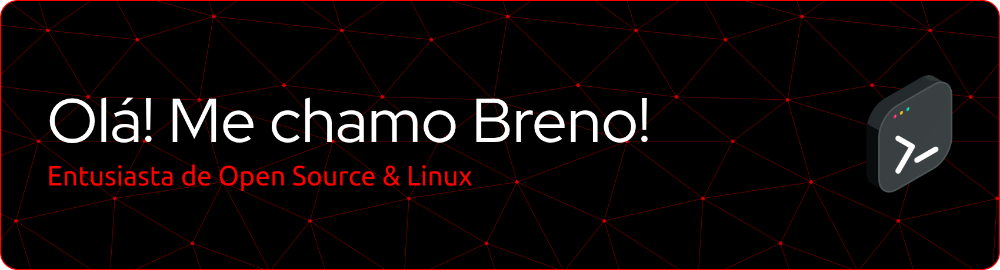

#### Prazer, me chamo Breno, tenho 16 anos e sou natural de Minas Gerais. Atualmente, estou no ensino médio cursando Técnico Integrado em Automação Industrial no IFMG. Gosto bastante de tecnologia e de adquirir novos conhecimentos. I use Linux BTW.  

# Tech Setup

| 💻 Hardware |   🎒 Inventário   | 🛜 Social |
| :--- | :----- | ---: |
| **HP EliteBook 840 G4**   i5-7200U (4) @ 3.10GHz   Intel HD Graphics 620   512GB NVMe + 120GB Sata   16GB DDR4 2133MHz (Dual-Channel) |               |  |

# 📊 Estatísticas

